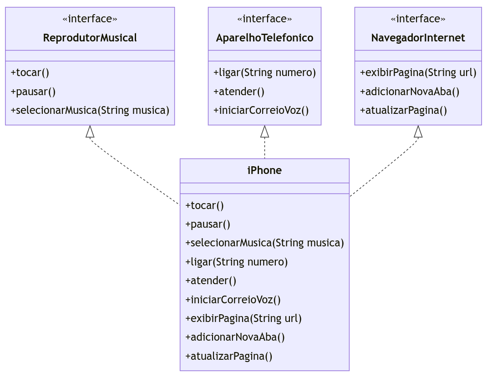

# Diagrama Lançamento iPhone 2017

[Lançamento iPhone 2017 ](https://www.youtube.com/watch?v=9ou608QQRq8)

**Reprodutor Musical**

# Interface ReprodutorMusical

Métodos: tocar(), pausar(), selecionarMusica(String musica)
Aparelho Telefônico

# Interface AparelhoTelefonico

Métodos: ligar(String numero), atender(), iniciarCorreioVoz()
Navegador na Internet

# Interface NavegadorInternet

Métodos: exibirPagina(String url), adicionarNovaAba(), atualizarPagina()
Classe iPhone

Implementa as três interfaces: ReprodutorMusical, AparelhoTelefonico e NavegadorInternet

## Modelagem UML

# [Modelo implementado](/poo/)
